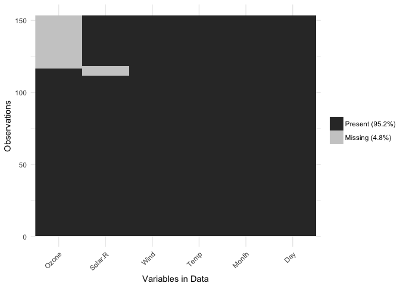

<!-- README.md is generated from README.Rmd. Please edit that file -->
visdat
======

What does visdat do?
====================

Initially inspired by [`csv-fingerprint`](https://github.com/setosa/csv-fingerprint), `vis_dat` helps you visualise a dataframe and "get a look at the data" by displaying the variable classes in a dataframe as a plot with `vis_dat`, and getting a brief look into missing data patterns `vis_miss`.

The name `visdat` was chosen as I think in the future it could be integrated with [`testdat`](https://github.com/ropensci/testdat). The idea being that first you visualise your data (`visdat`), then you run tests from `testdat` to fix them.

There are currently two main commands: `vis_dat` and `vis_miss`.

-   `vis_dat` visualises a dataframe showing you what the classes of the columns are, and also displaying the missing data.

-   `vis_miss` visualises the missing data, and allows for missingness to be clustered and columns rearranged. `vis_miss` is similar to `missing.pattern.plot` from the `mi` package. Unfortunately `missing.pattern.plot` is no longer in the `mi` package (well, at 14/02/2016).

How to install
==============

``` r
# install.packages("devtools")

library(devtools)

install_github("tierneyn/visdat")
```

Example
=======

Let's see what's inside the dataset `airquality`

``` r
library(visdat)

vis_dat(airquality)
```


The classes are represented on the legend, and missing data represented by grey. This tells us that R reads this dataset as having numeric and integer values, along with some missing data in `Ozone` and `Solar.R`.

We can explore the missing data further using `vis_miss`

``` r

vis_miss(airquality)
```


You can further cluster the missingness and arrange the columns by missingness by setting `cluster = TRUE` and `sort_cols = TRUE`.

``` r

vis_miss(airquality, 
         cluster = TRUE,
         sort_cols = TRUE)
```



Future work
===========

In the future I am keen to explore how to allow for each cell to be colored according to its type (e.g., strings, factors, integers, decimals, dates, missing data). It would also be really cool to get this function to "intelligently" read in data types.

`vis_datly`. `vis_dat` could include an interactive version of the plots using `plotly`, so that you can actually *see* what is inside the data.

Thank you
=========

Thank you to Jenny Bryan, whose [tweet](https://twitter.com/JennyBryan/status/679011378414268416) got me thinking about vis\_dat, and for her code contributions.

Thanks also to Noam Ross for his suggestions on using plotly with visdat.
