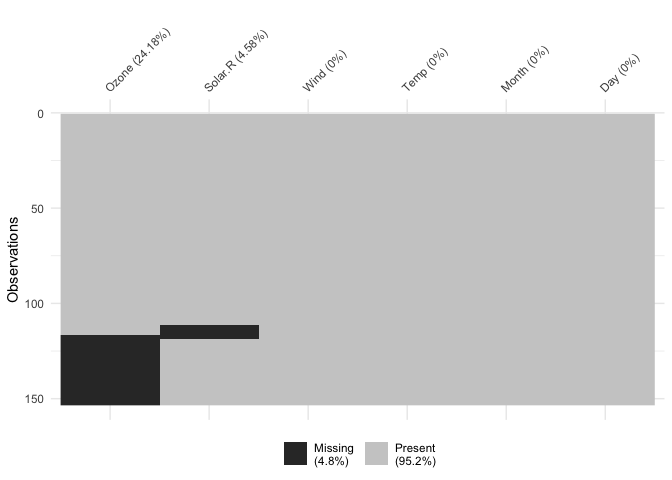
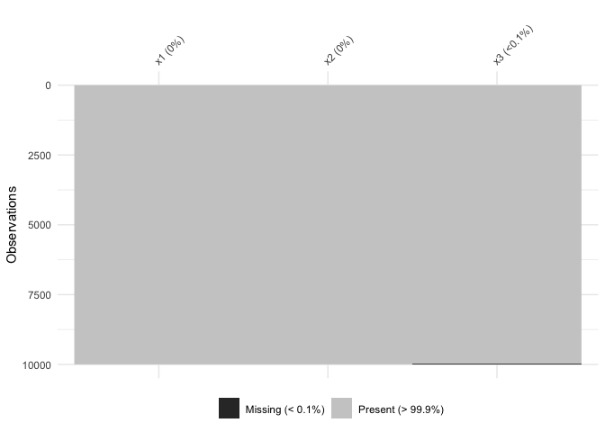
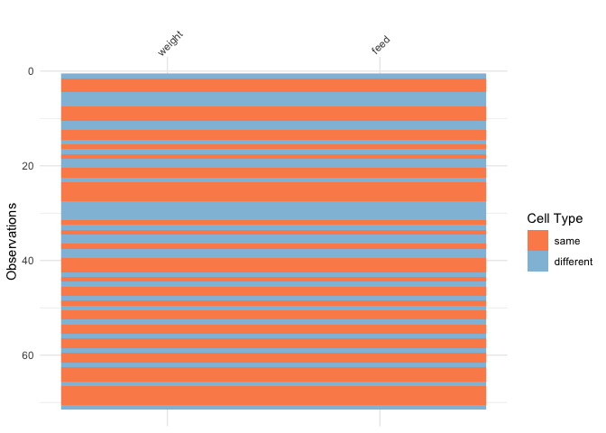
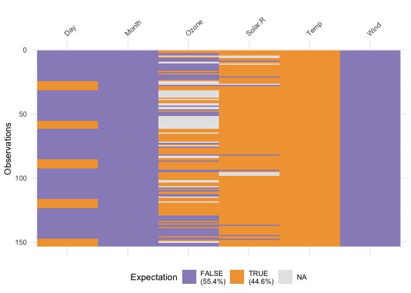

<!-- README.md is generated from README.Rmd. Please edit that file -->

# visdat 

[](https://github.com/ropensci/onboarding/issues/87)[](http://joss.theoj.org/papers/c85f57adbc565b064fb4bfc9b59a1b2a)[](https://zenodo.org/badge/latestdoi/50553382)[](https://travis-ci.org/ropensci/visdat)[](https://ci.appveyor.com/project/ropensci/visdat)[](https://codecov.io/github/ropensci/visdat?branch=master)[](https://cran.r-project.org/package=visdat)[](http://cran.rstudio.com/web/packages/visdat/index.html)[](http://www.repostatus.org/#active)

# How to install

visdat is available on CRAN

``` r

install.packages("visdat")
```

If you would like to use the development version, install from github
with:

``` r

# install.packages("devtools")
devtools::install_github("ropensci/visdat")
```

# What does visdat do?

Initially inspired by
[`csv-fingerprint`](https://github.com/setosa/csv-fingerprint),
`vis_dat` helps you visualise a dataframe and “get a look at the data”
by displaying the variable classes in a dataframe as a plot with
`vis_dat`, and getting a brief look into missing data patterns using
`vis_miss`.

`visdat` has 6 functions:

  - `vis_dat()` visualises a dataframe showing you what the classes of
    the columns are, and also displaying the missing data.

  - `vis_miss()` visualises just the missing data, and allows for
    missingness to be clustered and columns rearranged. `vis_miss()` is
    similar to `missing.pattern.plot` from the
    [`mi`](https://cran.r-project.org/web/packages/mi/index.html)
    package. Unfortunately `missing.pattern.plot` is no longer in the
    `mi` package (as of 14/02/2016).

  - `vis_compare()` visualise differences between two dataframes of the
    same dimensions

  - `vis_expect()` visualise where certain conditions hold true in your
    data

  - `vis_cor()` visualise the correlation of variables in a nice heatmap

  - `vis_guess()` visualise the individual class of earch value in your
    data

You can read more about visdat in the vignette, [“using
visdat”](http://visdat.njtierney.com/articles/using_visdat.html).

Please note that this project is released with a [Contributor Code of
Conduct](CONDUCT.md). By participating in this project you agree to
abide by its terms.

# Examples

## Using `vis_dat()`

Let’s see what’s inside the `airquality` dataset from base R, which
contains information about daily air quality measurements in New York
from May to September 1973. More information about the dataset can be
found with `?airquality`.

``` r

library(visdat)

vis_dat(airquality)
```

<!-- -->

The plot above tells us that R reads this dataset as having numeric and
integer values, with some missing data in `Ozone` and `Solar.R`. The
classes are represented on the legend, and missing data represented by
grey. The column/variable names are listed on the x axis.

## Using `vis_miss()`

We can explore the missing data further using `vis_miss()`:

``` r

vis_miss(airquality)
```

<!-- -->

Percentages of missing/complete in `vis_miss` are accurate to 1 decimal
place.

You can cluster the missingness by setting `cluster = TRUE`:

``` r

vis_miss(airquality, 
         cluster = TRUE)
```

<!-- -->

Columns can also be arranged by columns with most missingness, by
setting `sort_miss = TRUE`:

``` r

vis_miss(airquality,
         sort_miss = TRUE)
```

<!-- -->

`vis_miss` indicates when there is a very small amount of missing data
at \<0.1% missingness:

``` r

test_miss_df <- data.frame(x1 = 1:10000,
                           x2 = rep("A", 10000),
                           x3 = c(rep(1L, 9999), NA))

vis_miss(test_miss_df)
```

<!-- -->

`vis_miss` will also indicate when there is no missing data at all:

``` r

vis_miss(mtcars)
```

<!-- -->

To further explore the missingness structure in a dataset, I recommend
the [`naniar`](https://github.com/njtierney/naniar) package, which
provides more general tools for graphical and numerical exploration of
missing values.

## Using `vis_compare()`

Sometimes you want to see what has changed in your data. `vis_compare()`
displays the differences in two dataframes of the same size. Let’s look
at an example.

Let’s make some changes to the `chickwts`, and compare this new dataset:

``` r
set.seed(2019-04-03-1105)
chickwts_diff <- chickwts
chickwts_diff[sample(1:nrow(chickwts), 30),sample(1:ncol(chickwts), 2)] <- NA

vis_compare(chickwts_diff, chickwts)
```

<!-- -->

Here the differences are marked in blue.

If you try and compare differences when the dimensions are different,
you get an ugly error:

``` r

chickwts_diff_2 <- chickwts
chickwts_diff_2$new_col <- chickwts_diff_2$weight*2

vis_compare(chickwts, chickwts_diff_2)
# Error in vis_compare(chickwts, chickwts_diff_2) : 
#   Dimensions of df1 and df2 are not the same. vis_compare requires dataframes of identical dimensions.
```

## Using `vis_expect()`

`vis_expect` visualises certain conditions or values in your data. For
example, If you are not sure whether to expect values greater than 25 in
your data (airquality), you could write: `vis_expect(airquality, ~.x
>= 25)`, and you can see if there are times where the values in your
data are greater than or equal to 25:

``` r

vis_expect(airquality, ~.x >= 25)
```

<!-- -->

This shows the proportion of times that there are values greater than
25, as well as the missings.

## Using `vis_cor()`

To make it easy to plot correlations of your data, use `vis_cor`:

``` r

vis_cor(airquality)
```

<!-- -->

## Using `vis_guess()`

`vis_guess()` takes a guess at what each cell is. It’s best illustrated
using some messy data, which we’ll make here:

``` r

messy_vector <- c(TRUE,
                  T,
                  "TRUE",
                  "T",
                  "01/01/01",
                  "01/01/2001",
                  NA,
                  NaN,
                  "NA",
                  "Na",
                  "na",
                  "10",
                  10,
                  "10.1",
                  10.1,
                  "abc",
                  "$%TG")

set.seed(2019-04-03-1106)
messy_df <- data.frame(var1 = messy_vector,
                       var2 = sample(messy_vector),
                       var3 = sample(messy_vector))
```

``` r

vis_guess(messy_df)
vis_dat(messy_df)
```


So here we see that there are many different kinds of data in your
dataframe. As an analyst this might be a depressing finding. We can see
this comparison above.

# Thank yous

Thank you to Ivan Hanigan who [first
commented](http://www.njtierney.com/r/missing%20data/rbloggers/2015/12/01/ggplot-missing-data/#comment-2388263747)
this suggestion after I made a blog post about an initial prototype
`ggplot_missing`, and Jenny Bryan, whose
[tweet](https://twitter.com/JennyBryan/status/679011378414268416) got me
thinking about `vis_dat`, and for her code contributions that removed a
lot of errors.

Thank you to Hadley Wickham for suggesting the use of the internals of
`readr` to make `vis_guess` work. Thank you to Miles McBain for his
suggestions on how to improve `vis_guess`. This resulted in making it at
least 2-3 times faster. Thanks to Carson Sievert for writing the code
that combined `plotly` with `visdat`, and for Noam Ross for suggesting
this in the first place. Thank you also to Earo Wang and Stuart Lee for
their help in getting capturing expressions in `vis_expect`.

Finally thank you to [rOpenSci](https://github.com/ropensci) and it’s
amazing [onboarding process](https://github.com/ropensci/onboarding),
this process has made visdat a much better package, thanks to the editor
Noam Ross (@noamross), and the reviewers Sean Hughes (@seaaan) and Mara
Averick (@batpigandme).

[](https://ropensci.org)
